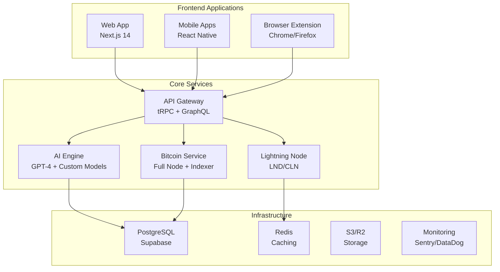

# 🚀 MOOSH - The World's First AI-Powered Bitcoin Wallet

<div align="center">
  
  
  [](LICENSE)
  [](https://www.typescriptlang.org/)
  [](https://bitcoin.org)
  [](https://openai.com)
  
  **Building the future of Bitcoin custody with AI intelligence**
  
  [Website](https://moosh.money) • [Documentation](https://docs.moosh.money) • [Twitter](https://twitter.com/mooshwallet) • [Discord](https://discord.gg/moosh)
</div>

## 🌟 Vision

MOOSH is revolutionizing Bitcoin custody by combining cutting-edge AI technology with a delightful user experience. We're building the wallet that makes Bitcoin accessible to everyone while maintaining the highest security standards.

### Why MOOSH?

- **🤖 AI-First**: Natural language commands, intelligent transaction optimization, and predictive analytics
- **🔐 Enterprise Security**: Multi-party computation, hardware wallet support, and formal verification
- **⚡ Lightning Fast**: Native Lightning Network and Spark Protocol integration
- **🎨 Beautiful UX**: Terminal-inspired design that's both powerful and playful
- **🌍 Multi-Platform**: Web, mobile, browser extension - your Bitcoin everywhere
- **🎮 Gaming Ready**: Built-in support for Ordinals, Runes, and future gaming integrations

## 🏗️ Architecture



## 🚀 Quick Start

### Prerequisites

- Node.js 20+
- pnpm 8.15+
- PostgreSQL 15+
- Redis 7+
- Bitcoin Core (optional for development)

### Installation

```bash
# Clone the repository
git clone https://github.com/moosh-wallet/moosh-ai-wallet.git
cd moosh-ai-wallet

# Install dependencies
pnpm install

# Set up environment variables
cp .env.example .env.local

# Set up the database
pnpm db:push

# Start development servers
pnpm dev
```

### Development Commands

```bash
pnpm dev          # Start all apps in development mode
pnpm build        # Build all apps for production
pnpm test         # Run all tests
pnpm lint         # Lint all packages
pnpm typecheck    # Type check all packages
```

## 📦 Monorepo Structure

```
moosh-ai-wallet/
├── apps/
│   ├── web/              # Next.js web application
│   ├── mobile/           # React Native mobile app
│   ├── extension/        # Browser extension
│   └── marketplace/      # NFT/Ordinals marketplace
├── packages/
│   ├── @moosh/core/      # Core wallet logic
│   ├── @moosh/bitcoin/   # Bitcoin integration
│   ├── @moosh/lightning/ # Lightning Network
│   ├── @moosh/ai/        # AI services
│   ├── @moosh/ui/        # Shared UI components
│   └── ...               # More packages
├── services/
│   ├── api/              # Backend API
│   ├── indexer/          # Blockchain indexer
│   └── ai-engine/        # AI processing service
└── infrastructure/       # Deployment configs
```

## 🛡️ Security

Security is our top priority. MOOSH implements:

- **Multi-Party Computation (MPC)** for distributed key management
- **Hardware Security Module (HSM)** integration
- **Formal verification** of critical paths
- **Regular security audits** by leading firms
- **Bug bounty program** (coming soon)

See [SECURITY.md](SECURITY.md) for details.

## 🤝 Contributing

We're building MOOSH in public and welcome contributions!

1. Read our [Contributing Guide](CONTRIBUTING.md)
2. Check out [good first issues](https://github.com/moosh-wallet/moosh-ai-wallet/issues?q=is%3Aissue+is%3Aopen+label%3A%22good+first+issue%22)
3. Join our [Discord](https://discord.gg/moosh) to discuss ideas

## 📊 Tech Stack

### Core Technologies
- **Framework**: Next.js 14 (App Router)
- **Language**: TypeScript 5.3
- **Database**: PostgreSQL (Supabase)
- **Caching**: Redis
- **API**: tRPC + GraphQL
- **Authentication**: Clerk
- **Payments**: Stripe

### Blockchain
- **Bitcoin**: BitcoinJS + Custom Indexer
- **Lightning**: LND/CLN Integration
- **Ordinals**: Ord + Custom Parser
- **Cross-chain**: Planned for v2

### AI Stack
- **LLM**: OpenAI GPT-4 + Claude
- **Embeddings**: OpenAI + Custom Models
- **Vector DB**: Pinecone
- **Orchestration**: LangChain

### Infrastructure
- **Hosting**: Vercel + AWS
- **Database**: Supabase
- **Monitoring**: Sentry + DataDog
- **CI/CD**: GitHub Actions

## 🗺️ Roadmap

### Phase 1: Foundation (Q1 2025) ✅
- [x] Monorepo setup
- [x] Core wallet functionality
- [x] Basic AI assistant
- [ ] Web app MVP
- [ ] Security audit #1

### Phase 2: Bitcoin Native (Q2 2025) 🚧
- [ ] Ordinals support
- [ ] BRC-20 tokens
- [ ] Runes protocol
- [ ] Lightning Network
- [ ] Mobile apps

### Phase 3: AI Enhancement (Q3 2025) 📋
- [ ] Advanced AI features
- [ ] Predictive analytics
- [ ] Natural language transactions
- [ ] Cross-chain support
- [ ] Browser extension

### Phase 4: Ecosystem (Q4 2025) 🔮
- [ ] NFT marketplace
- [ ] Gaming integration
- [ ] MOOSH token utility
- [ ] DeFi features
- [ ] Global expansion

## 💼 Company

MOOSH Wallet Limited is incorporated in Hong Kong, positioned at the intersection of East and West for global Bitcoin adoption.

- **Founded**: 2024
- **Location**: Hong Kong 🇭🇰
- **Mission**: Make Bitcoin accessible to everyone through AI
- **Team**: Growing! [We're hiring](https://moosh.money/careers)

## 📄 License

MOOSH is open source under the [MIT License](LICENSE).

## 🙏 Acknowledgments

Built with love by the MOOSH team and contributors worldwide.

Special thanks to:
- Bitcoin Core developers
- Lightning Network teams
- Ordinals community
- Our early supporters

---

<div align="center">
  <strong>Ready to revolutionize Bitcoin?</strong>
  
  [🌟 Star us on GitHub](https://github.com/moosh-wallet/moosh-ai-wallet) • [🐦 Follow on Twitter](https://twitter.com/mooshwallet) • [💬 Join Discord](https://discord.gg/moosh)
</div> 